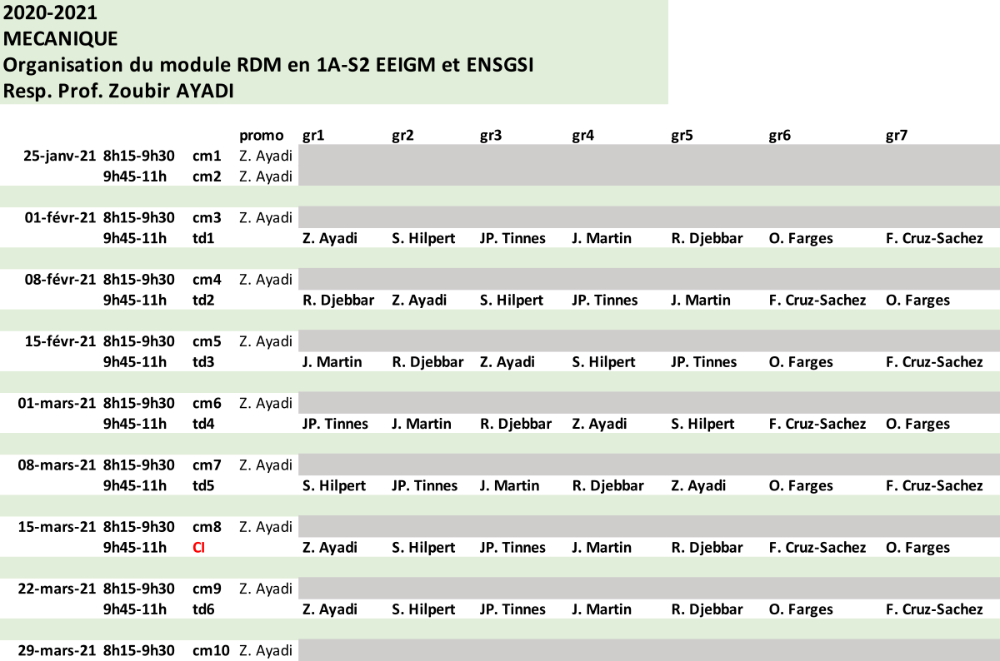

--- 
title: "TD's: Résistances de Matériaux - EEIGM - ENSGSI"
author: "Olivier FARGE, Fangkai XUE et Fabio CRUZ"
date: "`r Sys.Date()`"
site: bookdown::bookdown_site
documentclass: book
bibliography: [book.bib, packages.bib]
biblio-style: apalike
link-citations: yes
description: "This is a minimal example of using the bookdown package to write a book. The output format for this example is bookdown::gitbook."
---

```{r include=FALSE}
# automatically create a bib database for R packages
knitr::write_bib(c(
  .packages(), 'bookdown', 'knitr', 'rmarkdown'
), 'packages.bib')

#bookdown::render_book("index.Rmd", "bookdown::pdf_book")

```

# Résistances des Matériaux {-}

## Planning {-}

```{r echo=FALSE, out.width = "600pt", fig.align='center', cache=TRUE}

```


```{r echo=FALSE, out.width = "600pt", fig.align='center', cache=TRUE}

```


